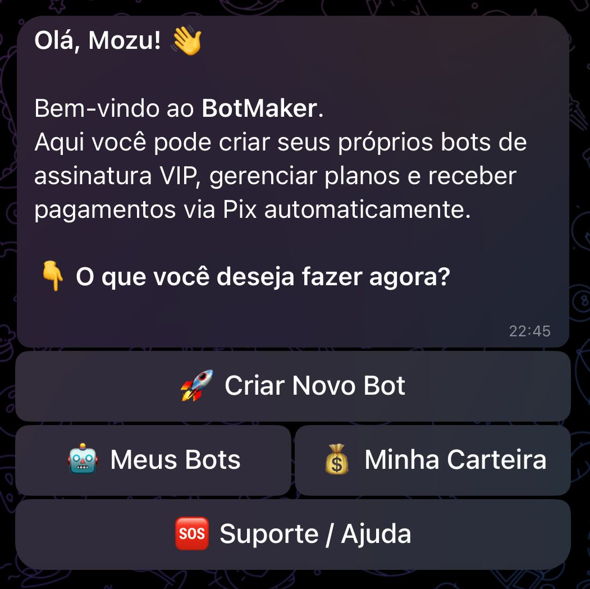
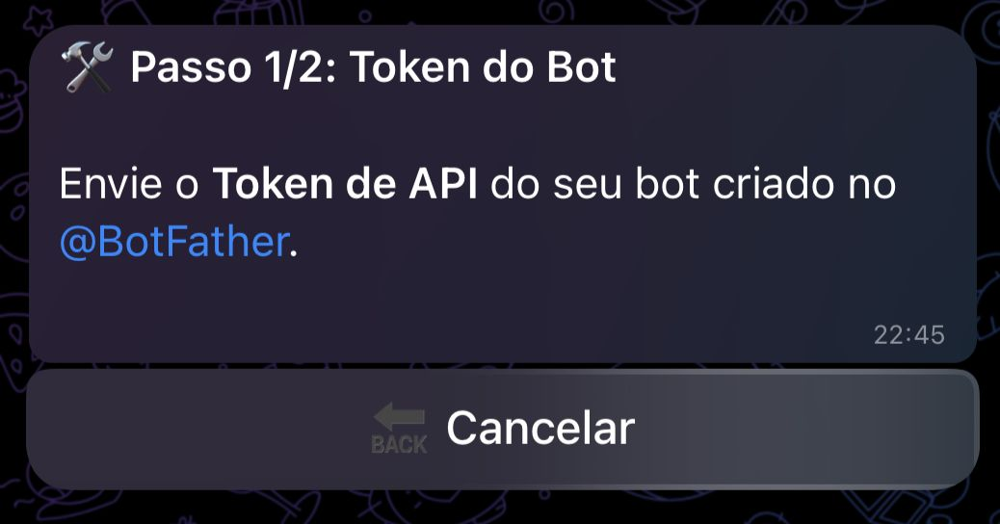
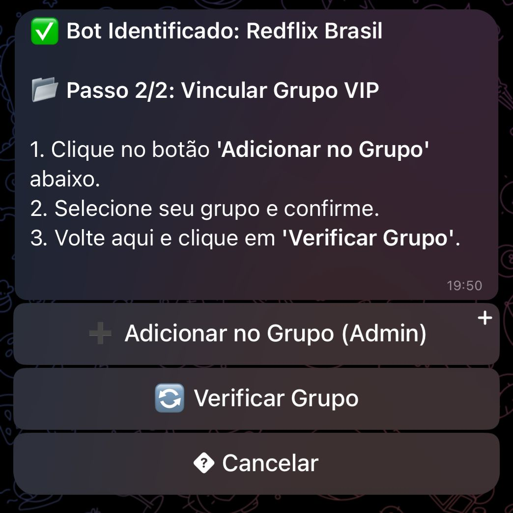
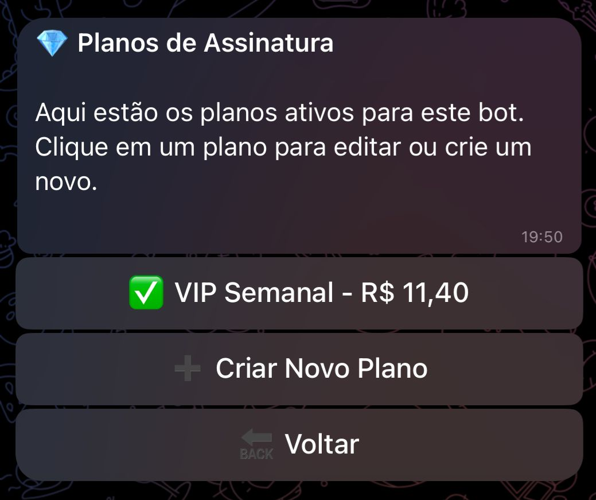
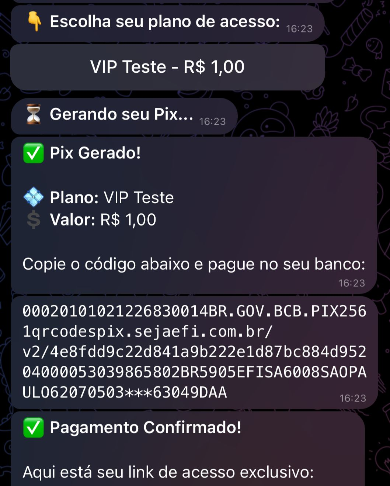

# 🟣 Botify - Automação de Grupos VIP no Telegram

> **Transforme seu canal ou grupo em uma máquina de vendas automática via Pix.** 🚀

O **Botify** é uma plataforma completa que permite gerenciar assinaturas, processar pagamentos e controlar o acesso de membros aos seus grupos privados, tudo sem intervenção manual.

---

## 📋 Funcionalidades Principais

* 🤖 **Multi-Bots:** Crie e gerencie múltiplos bots de venda em um único painel.
* 💰 **Pix Automático:** Geração de Pix Copia e Cola com baixa instantânea.
* ⚡ **Acesso Imediato:** O usuário paga e o robô libera o link único de entrada na hora.
* 📅 **Gestão de Planos:** Crie planos mensais, trimestrais ou vitalícios.
* 🚫 **Expulsão Automática:** Remove membros inadimplentes automaticamente ao fim do plano.
* 📢 **Recuperação de Vendas:** Sistema de follow-up automático para quem gerou Pix e não pagou.
* 💸 **Carteira e Saque:** Painel financeiro completo com solicitação de saque via Pix.

---

## 📚 Tutorial Passo a Passo

Siga este guia para configurar sua primeira operação de vendas.

### 1️⃣ Iniciando no Painel Principal
Ao dar `/start` no bot principal, você terá acesso ao **Painel de Controle**. Aqui você vê seus bots ativos, saldo disponível e ferramentas de administração.

### 2️⃣ Criando seu Vendedor (Bot Filho)
Não vendemos pelo bot principal! Você cria o **seu próprio bot** (com seu nome e logo) para atender seus clientes.

1.  Vá no **@BotFather** e crie um novo bot (`/newbot`).
2.  Copie o **Token API** gerado.
3.  No Botify, clique em **"🤖 Criar Novo Bot"** e cole o token.

### 3️⃣ Vinculando ao Grupo VIP
O sistema precisa de permissão para adicionar e remover pessoas do seu grupo.

1.  Adicione o bot que você acabou de criar no seu Grupo VIP.
2.  **Promova ele a Administrador** (Dê permissão de "Adicionar Usuários" e "Banir Usuários").
3.  Volte ao Botify e clique em **"🔄 Verificar Grupo"**.

### 4️⃣ Criando Planos de Venda
Agora vamos definir o que você vai vender.

1.  Acesse **"Meus Bots"** e selecione o bot configurado.
2.  Clique em **"💎 Gerenciar Planos"** > **"➕ Novo Plano"**.
3.  Defina: **Nome** (ex: VIP Mensal), **Valor** (ex: 29.90) e **Duração** (em dias).

---

## 🛒 Experiência do Seu Cliente

É assim que o seu cliente vê o processo de compra:

1.  Ele clica no link do seu bot e dá `/start`.
2.  O bot envia a mensagem de boas-vindas e os botões dos planos.
3.  Ao escolher, o **Pix Copia e Cola** é gerado instantaneamente.
4.  Assim que o pagamento cai (segundos depois), o bot envia um **Link de Convite Único** (que só funciona para uma pessoa).

---

## 💸 Gestão Financeira (Carteira)

Acompanhe seus ganhos em tempo real.

* **Saldo Disponível:** Valor líquido já descontando taxas.
* **Extrato:** Histórico detalhado de todas as vendas e saques.
* **Solicitar Saque:** Envie o saldo direto para sua conta bancária via Pix.

*(Mostre a tela de saldo e o histórico de transações)*
